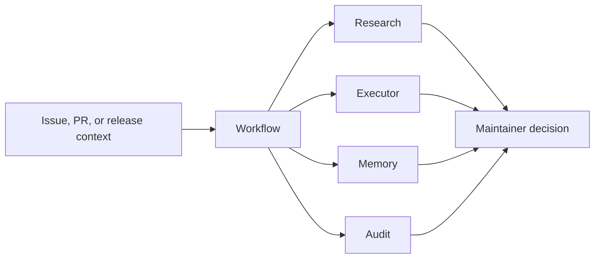

# OSS Maintainer Agent Kit

Small, auditable prompt orchestration for open-source maintainers.

This repository provides a command-line workflow for turning maintainer work into
structured agent prompts: issue triage, pull request review, release notes, and
final audit. It is intentionally provider-neutral. You can preview prompts
without sending anything to an AI provider, then opt in to running a local agent
command such as Codex CLI, Claude Code, or another stdin-compatible tool.

## Why this exists

Maintainers spend a lot of time on repeatable review work:

- reproducing vague bug reports
- classifying issues and duplicates
- checking pull requests against project conventions
- drafting release notes from merged changes
- doing a second-pass audit before publishing

This kit makes those workflows explicit and repeatable. It keeps the prompts,
roles, and safety checks in version control so contributors can understand and
improve the maintenance process.

## Features

- Provider-neutral CLI with dry-run mode by default
- Built-in workflows for `triage`, `review`, `release`, and `audit`
- Role prompts for research, execution planning, memory/context, and audit
- Codex CLI provider presets for OpenAI-compatible maintainer workflows
- GitHub issue and pull request templates for maintainer workflows
- No runtime dependencies outside Python standard library
- Tests and GitHub Actions CI
- Public-ready docs for contribution and security reporting

## Architecture



## Quick start

```bash
python3 -m venv .venv
. .venv/bin/activate
python -m pip install -e .
maintainer-agent triage examples/issue.md --dry-run
```

Dry-run mode prints the prompts that would be sent to each role. Nothing leaves
your machine.

To run an agent command, pass `--run` and a command that accepts the prompt on
stdin:

```bash
maintainer-agent triage examples/issue.md \
  --run \
  --agent-command "codex exec -"
```

You can also use a built-in Codex preset:

```bash
maintainer-agent review examples/pr-review.md \
  --run \
  --preset codex-read-only
```

Commands may also use a `{prompt}` placeholder when the provider expects the
prompt as an argument. The placeholder must be its own command argument:

```bash
maintainer-agent review examples/pr-review.md \
  --run \
  --agent-command "claude -p {prompt}"
```

## Workflows

### Issue triage

```bash
maintainer-agent triage examples/issue.md --dry-run
```

Produces role-specific prompts to classify the issue, ask for missing evidence,
suggest reproduction steps, and decide whether the issue is actionable.

### Pull request review

```bash
maintainer-agent review examples/pr-review.md --dry-run
```

Focuses on correctness, regression risk, tests, docs, and release impact.

### Release notes

```bash
maintainer-agent release examples/release-input.md --dry-run
```

Drafts maintainable release notes from a changelog or commit summary.

### Final audit

```bash
maintainer-agent audit examples/pr-review.md --dry-run
```

Runs a single audit-focused pass for security, privacy, regressions, and missing
verification.

## Safety model

The default mode is read-only prompt preview. The CLI does not push code, submit
forms, upload files, or change repository settings.

When `--run` is used, the tool executes only the command you pass explicitly.
Prompts are supplied by stdin unless you opt into a `{prompt}` placeholder.

Before using this on a real repository, review:

- [Publication checklist](docs/PUBLICATION_CHECKLIST.md)
- [Provider presets](docs/PROVIDERS.md)
- [Publishing guide](docs/PUBLISHING.md)
- [Roadmap](docs/ROADMAP.md)
- [Security policy](SECURITY.md)
- [Contribution guide](CONTRIBUTING.md)

## Project status

This is an early public-ready seed. The immediate roadmap is to add GitHub issue
and pull request import helpers, provider presets, and golden-output tests for
common maintainer tasks.
